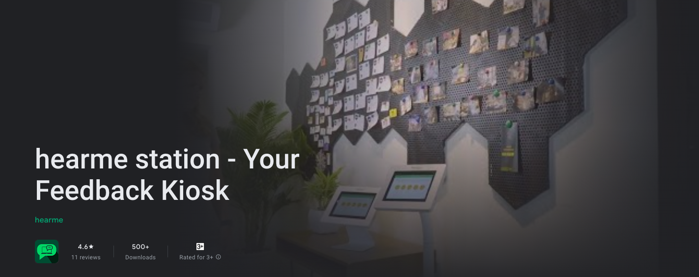

# hearme station
```
[](http://hearme.vn)
```

## Description
The **hearme station** module is an open-source repository that allows clients to modify the UI and application logic as per their needs. With this module, users can create feedback kiosks that are tailored to their specific requirements. The module is part of the **hearme** CXM platform, which provides a full suite of tools for collecting and analyzing customer feedback.

- **hearme station** is an open-source hybrid mobile application that allows you to collect customer feedback. It uses services from the **hearme** platform, which provides a full suite of tools for collecting and analyzing customer feedback.

- To get started with **hearme station**, you need to register an account on the **hearme** website at hearme.vn. Once you have registered, you can configure your account as per the steps guided in the onboarding page.

- With **hearme station**, you can modify the feedback screen to suit your brand or intercept feedback events before and after sending feedback. Every feedback logic is processed, and you can configure questionnaires in the administration application.

- You can manage your feedback through the **hearme** web application at hearme.vn/zeus or by installing the **hearme CXM** mobile app on your iOS or Android device.

- This project use Ionic 2 framework

## Demonstration:
- Kiosk feedback channel: https://www.youtube.com/watch?v=e7KJPQUzvDc
- You can configure questions, image, and trademark as you want: https://www.youtube.com/watch?v=uzsVHHXlpNY


## Enviroment requirements
- Nodejs >= 8.17
- Ionic >= 2


### Running with Ionic CLI:

Install and start web platform

```bash
$ sudo npm install -g ionic cordova
$ ionic serve
```

Run in ios mobile platform:

```bash
$ ionic cordova platform add ios
$ ionic cordova run ios
```

Substitute ios for android if not on a Mac.

Build to release:

```
$ ionic cordova plugin rm cordova-plugin-console  # remove it before generating the release builds
$ ionic cordova build --release android
```

## Current version 3.5.0
- Adjust notification message for NPS: change max score from 11 to 10 (0-10)
- Update labels in thank pages
- Add field severity to feedback
- Improve form based UI
- Get focus and open keyboard for open question page and contact page
- Setting little bit delay before emiting event
- Default sound when there is not thank page

## Contact and support
hearme Limited company

Add: Toong office, 3th Floor, No. 8 Trang Thi, Hoan Kiem Dist., Hanoi, Vietnam

Tel: +84 24 66 635 539

Mobile: +84 912 083 463

Email: contact@hearme.vn 

Website: https://hearme.vn